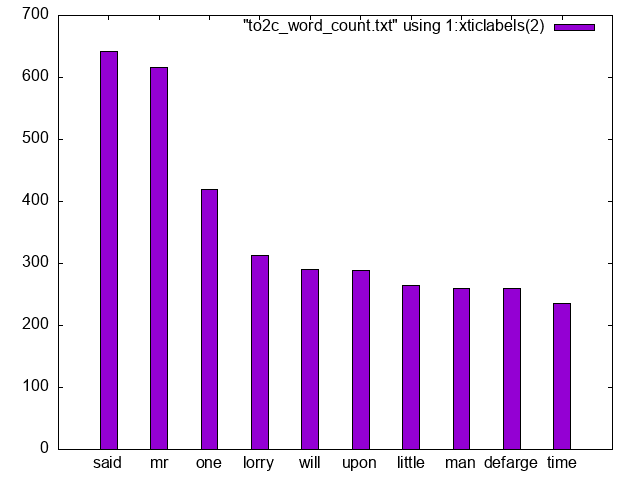

# Assignment 1 from Python for Data Science
Goal: Write a program in python to count the 10 most common words used in A Tale of Two Cities. Exclude the stop words in the stop words list. Plot the output. 

## How to make the graph
```
$ python3 my_answer.py > to2c_word_count.txt
$ gnuplot
gnuplot > set term png
gnuplot > set style data histograms
gnuplot > set style fill solid 1.0 border -1
gnuplot > set output 'to2c_word_counts.png'
gnuplot > plot [][0:] "to2c_word_count.txt" using 1:xticlabels(2)
gnuplot > exit
```

